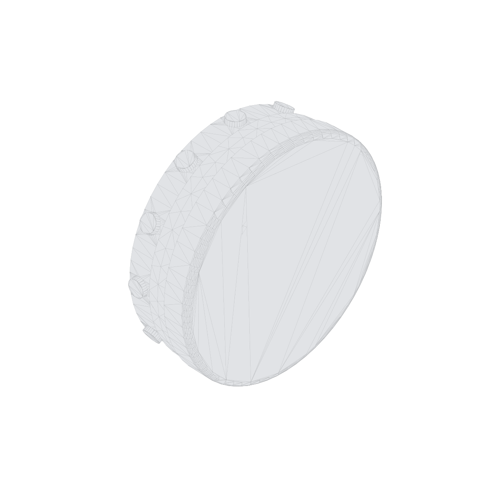

# Vault Study

We're recreating **Adam Savage's miniature (1/12-scale) bank-vault
door** — the one he machines on his
[Tested YouTube series](https://www.tested.com/) — as a public
**Onshape** model anyone can open and play with. Second act: the
same mechanism converted into a parametric design an FDM printer
can build.

## The model — try it

The faithful variant is a CAD reinterpretation of Adam's machined
design: module-0.5 gears, a 120-tooth ring + 12 × 24-tooth spurs,
12 rack-driven locking pins, a combination lock as gatekeeper.

- **[Open it in Onshape ↗](https://cad.onshape.com/documents/eaf3e87c1faae12ad867b335/w/83a96bb8921d1af3abd7aecd/e/9db299b535aaeded5de5120c)**
  — the live document. Drag the mechanism; with a free Onshape
  account you can copy the workspace and take it apart.
- **[Download the STEP](step-source/)** — the committed export, for
  any other CAD package.
- **[Interactive demo](https://jmcpheron.github.io/vault-study/interactive/)**
  — no CAD required; a slider drives all twelve pins in the browser.



Both documents are still being built — expect half-finished
geometry, and check the [build blog](https://jmcpheron.github.io/vault-study/)
for where things stand.

## The FDM conversion

The second act redesigns the same mechanism for desktop 3D
printers: cylinders become hex stock (anti-rotation without
keyways), tolerances loosen, parts orient to avoid supports. Aims
to be printable on a stock Bambu A1 / Prusa Mini class machine in
one evening's worth of jobs.

- **[Open the FDM variant in Onshape ↗](https://cad.onshape.com/documents/017898deda56c430272a5497/w/5d7667d0936a708006b152fa/e/8e68069be3521bc23b864206)**
- [`cad/fdm/deviations.md`](cad/fdm/deviations.md) — the home for
  every "why is the FDM one different?" answer.
- End state: a 3MF bundle on **MakerWorld** and **Printables** that
  anyone can print at home without reading any of this. _(Soon.)_

## The blog

**[jmcpheron.github.io/vault-study ↗](https://jmcpheron.github.io/vault-study/)**
— a visual development blog: exploded views, the gear math, pin
tolerance stack-ups, and the design decisions as they happen. The
evergreen reference pages (mechanics, gearing math, faithful-vs-FDM)
live there too.

## What's where

| Path | What it is |
| --- | --- |
| [`specs.md`](specs.md) | Canonical dimensions, source-tagged to the video they came from. The keystone. |
| [`cad/faithful/`](cad/faithful/) | Faithful-variant docs: Onshape doc link, modeling notes, FeatureScript settings. |
| [`cad/fdm/`](cad/fdm/) | FDM-variant docs + [`deviations.md`](cad/fdm/deviations.md). |
| [`step-source/`](step-source/) | Raw STEP exports from Onshape. The inbox; the tooling reads from here. |
| [`docs/`](docs/) | GitHub Pages site: the development blog + reference pages (Jekyll). |
| [`src/vaultkit/`](src/vaultkit/) | Python kernel — gear + tolerance math, and the render pipeline behind the blog's visuals. |
| [`log.md`](log.md) | Terse workshop journal. The blog is its illustrated public face. |

## Status (live links)

| Variant | Onshape | MakerWorld | Printables |
| --- | --- | --- | --- |
| Faithful | [open in Onshape ↗](https://cad.onshape.com/documents/eaf3e87c1faae12ad867b335/w/83a96bb8921d1af3abd7aecd/e/9db299b535aaeded5de5120c) | n/a (CAD study) | n/a (CAD study) |
| FDM | [open in Onshape ↗](https://cad.onshape.com/documents/017898deda56c430272a5497/w/5d7667d0936a708006b152fa/e/8e68069be3521bc23b864206) | _(soon)_ | _(soon)_ |

## How the visuals get made

Every diagram, table, and animation on the blog is *derived* — from
the Onshape STEP exports plus one canonical parameter file — by the
`vaultkit` Python kernel:

```
   Onshape docs ──STEP──▶ step-source/ ──vaultkit──▶ docs/ (blog + SVG/GIF/PNG)
                                             │
                                             └──▶ MakerWorld + Printables (3MF)
```

```bash
# Light install — gear + tolerance math, SVG diagrams, tests
pip install -e ".[dev]"

vaultkit gears info   # the gear-math summary derived from specs.md
vaultkit play         # the pin-play tolerance stack-up, faithful vs FDM

pytest                # includes the specs.md ↔ params.py drift test
ruff check src tests
```

The heavy CAD libraries (cadquery-ocp, trimesh, etc.) power the
STEP inspection and 3D renders and live behind
`pip install -e ".[heavy]"`, so contributors who only want to edit
prose aren't forced into a 180 MB OpenCascade wheel.

The repo follows the **Shareable CAD** pattern (Onshape → GitHub →
MakerWorld/Printables); the pattern doc is
[`SHAREABLE-CAD.md`](SHAREABLE-CAD.md).

## Attribution

Mechanism design, proportions, and gear math are Adam Savage's,
shown on the Tested YouTube series. This repo is an independent
educational CAD reinterpretation. Full attribution and source
links in [`ACKNOWLEDGMENTS.md`](ACKNOWLEDGMENTS.md).

## Licenses

- **Code** (`vaultkit`, tests, configs): MIT — see [`LICENSE`](LICENSE).
- **3D geometry** (STEP files, derived STL/3MF/renders): CC BY-SA 4.0
  — see [`LICENSE-3D-FILES`](LICENSE-3D-FILES).
