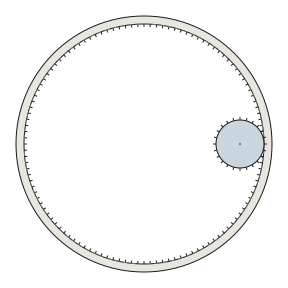

# The gearing math

<p style="text-align:center; margin: 1em 0;">
  
</p>

The vault has just one number that matters more than any other: the
**gear module**.

## Module: the meshing constant

Module is a metric gear-design parameter. For two gears to mesh, they
must share the same module. The vault uses **module 0.5 mm** for
every gear — the 120-tooth ring, all twelve 24-tooth spurs, and the
toothed face of each rack.

> If you change `MODULE_MM` in
> [`src/vaultkit/params.py`](https://github.com/jmcpheron/vault-study/blob/main/src/vaultkit/params.py),
> you change every gear in the assembly. That's what "parametric"
> means in practice.

## Pitch diameters fall out for free

Given module and tooth count, the pitch diameter (the imaginary circle
where the gears effectively touch) is just:

```
pitch_diameter = module × tooth_count
```

For the vault:

| Gear | Teeth | Pitch diameter |
| --- | --- | --- |
| Ring | 120 | 60 mm |
| Spur (×12) | 24 | 12 mm |

The ring is an **internal** gear (teeth point inward), so meshing
spurs sit *inside* its pitch circle. The center-to-center distance
between the ring's axis and any spur's axis is the **difference** of
the pitch radii:

```
center_distance = ring.pitch_radius - spur.pitch_radius
                = 30 mm - 6 mm
                = 24 mm
```

Two times that distance (the spurs sit on a circle around the ring)
is **48 mm — wait, no.** The bolt-circle diameter Adam measured in
part-2 is **72 mm**. That means the spurs sit on a 36 mm radius
from the door center, not a 24 mm radius. The two numbers don't
agree — and the disagreement is informative.

Resolving: the 72 mm BCD measures the *bolt-circle*, i.e. where the
shoulder bolts go through the acrylic puck. That circle is sized for
the spur gear's *axis position*, which lives at `ring_pitch_radius -
spur_pitch_radius` = **24 mm from center, i.e. 48 mm BCD on the gear
math alone.** The 72 mm BCD must therefore include geometry the gear
math doesn't see — likely an offset Adam added between the ring's
pitch circle and the acrylic's gear-mount face, or a different
interpretation of "where the spurs sit." This is exactly the kind of
discrepancy a future drift test should flag.

For now, [`gears.py`](https://github.com/jmcpheron/vault-study/blob/main/src/vaultkit/gears.py)
reports the derived center distance and prints both numbers side by
side in `vaultkit gears info` so the inconsistency is visible, not
hidden.

## The 5:1 ratio

The drive ratio of two meshing gears is `driven_teeth / driver_teeth`.
Drive the ring (120 teeth) → the spur (24 teeth) turns at **5×** the
ring's angular velocity. That's the only ratio in the system: one
rotation of the main lever → 5 rotations of each of the twelve
spurs → about 6 mm of pin travel (depending on rack length).

## Timing: 120 / 12 = 10

This is the wisdom Adam emphasises in part-2. The ring's tooth
count (120) must be **divisible by the number of pins** (12). If
it weren't, the spurs couldn't all sit at the same orientation
relative to the ring's teeth — they'd be slightly out of phase, and
the racks would push the pins to subtly different depths.

120 ÷ 12 = 10 means there are exactly 10 ring-teeth between the
center of any adjacent pair of spur-gear axes. The geometry doesn't
care which 10 — but the count must be a whole number. Real vaults
use 24 spurs around a 288-tooth ring: 288 ÷ 24 = 12. Same trick.

The kernel encodes this rule explicitly:
[`gears.teeth_between_satellites`](https://github.com/jmcpheron/vault-study/blob/main/src/vaultkit/gears.py)
raises `ValueError` if you try a non-divisible combination.

## The Spur Gear FeatureScript

Onshape's standard custom-feature library has a "Spur Gear"
generator. The settings the vault needs:

| Gear | Module | Teeth | Mode |
| --- | --- | --- | --- |
| Ring | 0.5 | 120 | Internal Gear |
| Spur (×12) | 0.5 | 24 | External (default) |

That's the whole input list. Onshape handles the involute profile,
the addendum, the root fillet, the everything-else of gear-tooth
geometry. **Don't try to sketch the teeth by hand.** The Spur Gear
FeatureScript is the single biggest reason this project is feasible
without a degree in mechanical engineering.

## See also

- [`specs.md`](https://github.com/jmcpheron/vault-study/blob/main/specs.md)
  — the canonical numbers, source-tagged to the videos they came from.
- [`src/vaultkit/gears.py`](https://github.com/jmcpheron/vault-study/blob/main/src/vaultkit/gears.py)
  — the math, in 60 lines of pure Python.
- [Why twelve pins?](why-twelve-pins.html) — the divisor argument
  pushed further.
