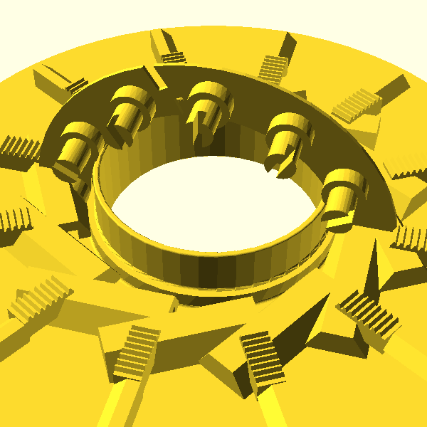

  <picture>
    <source srcset="assets/generated/mechanism-cam-sweep-fdm.webp" type="image/webp">
    
  </picture>

A hobby project to redesign Adam Savage's miniature bank-vault door
in parametric CAD, with two variants in parallel: a faithful
machined-style rebuild and an FDM-printable redesign.

  <a href="interactive.html">
    <h3>Interactive demo</h3>
    
Drag a slider, watch twelve pins extend in unison.

  </a>
  <a href="mechanics.html">
    <h3>How it works</h3>
    
Ring → spurs → racks → pins, in 200 words.

  </a>
  <a href="faithful-vs-fdm.html">
    <h3>Faithful vs FDM</h3>
    
What we kept, what we changed, why.

  </a>
  <a href="principles.html">
    <h3>Principles</h3>
    
Five things this project believes.

  </a>

## The whole machine in one paragraph

A 120-tooth ring gear sits in the centre of an acrylic puck. Twelve
24-tooth spur gears surround it; each drives a rack-and-pinion that
pushes a locking pin radially outward into the vault frame. A
miniature 3-wheel combination lock is the gatekeeper — dial the
right combination, a bell crank releases the ring gear, and a single
throw of the lever shoots all twelve pins at once. The rest of the
project is dimensions.

## More to dig into

- [The gearing math](gearing-math.html) — module, tooth counts, why
  the 5:1 ratio falls out for free.
- [Why twelve pins?](why-twelve-pins.html) — divisor math and the
  base-12 elegance.
- [The combination lock](combination-lock.html) — watchmaker-scale
  three-wheel mechanism in a 0.75" × 0.5" brass cage.
- [The hinge and frame](hinge-and-frame.html) — heavy-door swing
  kinematics, the clearance problem CAD catches for free.
- [FDM design considerations](fdm-variant.html) — cylinders → hex
  stock, tolerances, layer orientation.
- [Build log](build-log.html) — informal session notes.
- [Sources](sources.html) — the videos, with timestamps.

## Get the files

| Variant | Onshape | MakerWorld | Printables | STEP |
| --- | --- | --- | --- | --- |
| Faithful | _(placeholder)_ | n/a | n/a | [in repo](https://github.com/jmcpheron/vault-study/blob/main/step-source/unauthorized-vault-clone.step) |
| FDM | _(placeholder)_ | n/a | n/a | [in repo](https://github.com/jmcpheron/vault-study/blob/main/step-source/fdm-vault.step) |

## Credit

The mechanism design, the proportions, the gear math — all
[Adam Savage](https://www.tested.com/)'s work on the Tested YouTube
channel. This site is an independent CAD reinterpretation for
educational and hobby purposes. Full attribution in
[ACKNOWLEDGMENTS.md](https://github.com/jmcpheron/vault-study/blob/main/ACKNOWLEDGMENTS.md).
